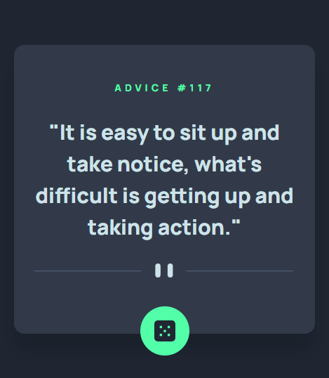
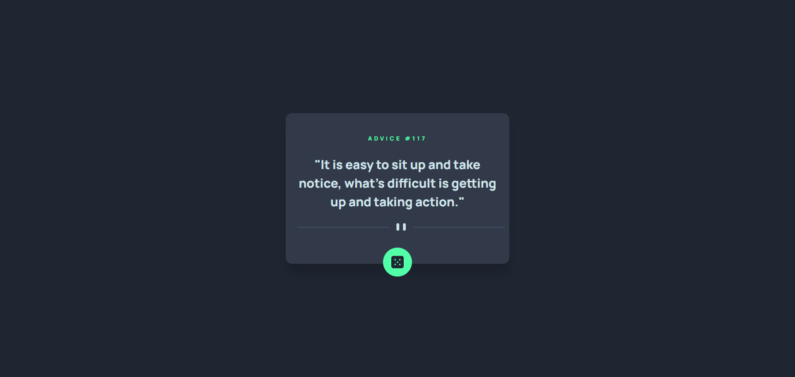
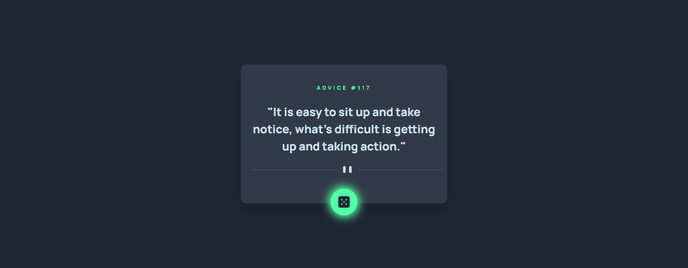

# Frontend Mentor - Advice generator app solution

This is a solution to the [Advice generator app challenge on Frontend Mentor](https://www.frontendmentor.io/challenges/advice-generator-app-QdUG-13db). Frontend Mentor challenges help you improve your coding skills by building realistic projects.

## Table of contents

  - [The challenge](#the-challenge)
  - [Screenshot](#screenshot)
  - [Links](#links)
- [My process](#my-process)
  - [Built with](#built-with)
  - [What I learned](#what-i-learned)
  - [Continued development](#continued-development)
  - [Useful resources](#useful-resources)
  - [AI Collaboration](#ai-collaboration)
- [Author](#author)
- [Acknowledgments](#acknowledgments)

### The challenge

Users should be able to:

- View the optimal layout for the app depending on their device's screen size
- See hover states for all interactive elements on the page
- Generate a new piece of advice by clicking the dice icon

### Screenshot

### Links

- Solution URL: [https://www.frontendmentor.io/solutions/responsive-advice-generator-with-semantic-html-css-and-vanilla-js-FQBZMQLexW](https://www.frontendmentor.io/solutions/responsive-advice-generator-with-semantic-html-css-and-vanilla-js-FQBZMQLexW)
- Live Site URL: [https://dmvdevaustin-advicegenerator.netlify.app](https://dmvdevaustin-advicegenerator.netlify.app)

## My process

### Built with

- Semantic HTML5 markup
- CSS custom properties
- Flexboxhttps://www.frontendmentor.io/solutions/responsive-advice-generator-with-semantic-html-css-and-vanilla-js-FQBZMQLexW
- CSS Grid
- Mobile-first workflow

## Author

- Frontend Mentor - [@thedmvdevaustin](https://www.frontendmentor.io/profile/thedmvdevaustin)
- Twitter - [@thedmvdevaustin](https://www.twitter.com/thedmvdevaustin)
- Linkedin - [@thedmvdevaustin](https://www.linkedin.com/in/thedmvdevaustin)