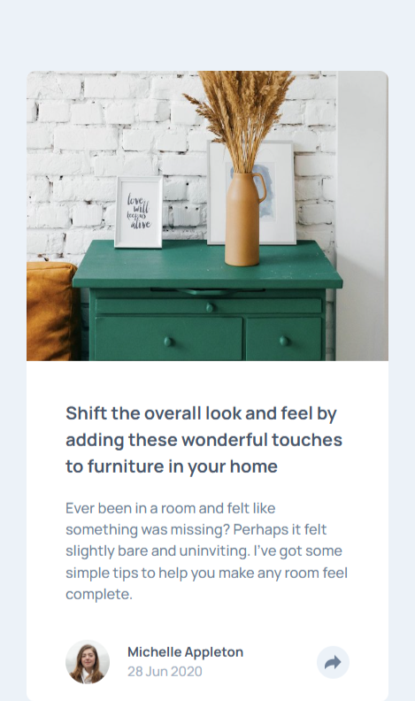
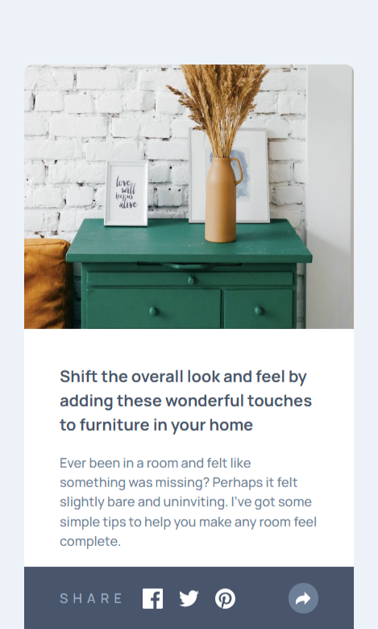
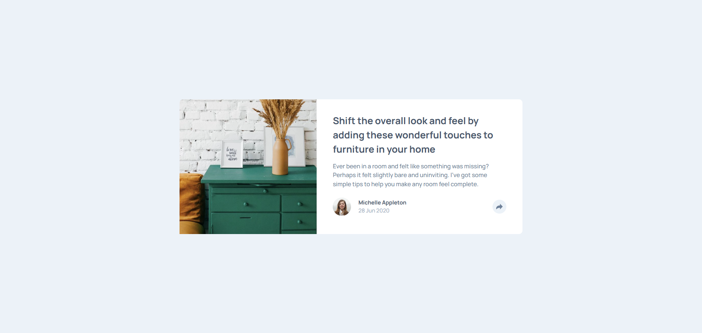
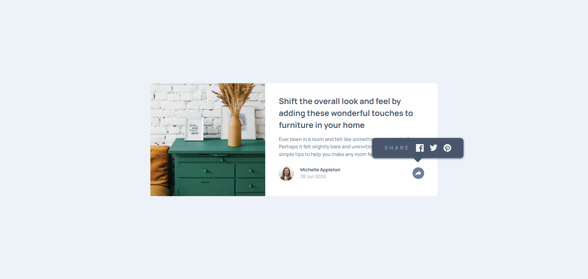

# Frontend Mentor - Article preview component solution

This is a solution to the [Article preview component challenge on Frontend Mentor](https://www.frontendmentor.io/challenges/article-preview-component-dYBN_pYFT). Frontend Mentor challenges help you improve your coding skills by building realistic projects. 

## Table of contents

- [Overview](#overview)
  - [The challenge](#the-challenge)
  - [Screenshot](#screenshot)
  - [Links](#links)
  - [Built with](#built-with)
- [Author](#author)

## Overview

### The challenge

Users should be able to:

- View the optimal layout for the component depending on their device's screen size
- See the social media share links when they click the share icon

### Screenshot

### Links

- Solution URL: [https://github.com/thedmvdevaustin/frontend-mentor-challenges/tree/main/articlePreviewComponent/article-preview-component-master](https://github.com/thedmvdevaustin/frontend-mentor-challenges/tree/main/articlePreviewComponent/article-preview-component-master)
- Live Site URL: [https://dmvdevaustin-article-component.netlify.app/](https://dmvdevaustin-article-component.netlify.app/)

## My process

### Built with

- Semantic HTML5 markup
- CSS custom properties
- Flexbox
- CSS Grid
- Mobile-first workflow

## Author

- Frontend Mentor - [@thedmvdevaustin](https://www.frontendmentor.io/profile/thedmvdevaustin)
- Twitter - [@thedmvdevaustin](https://www.twitter.com/thedmvdevaustin)
