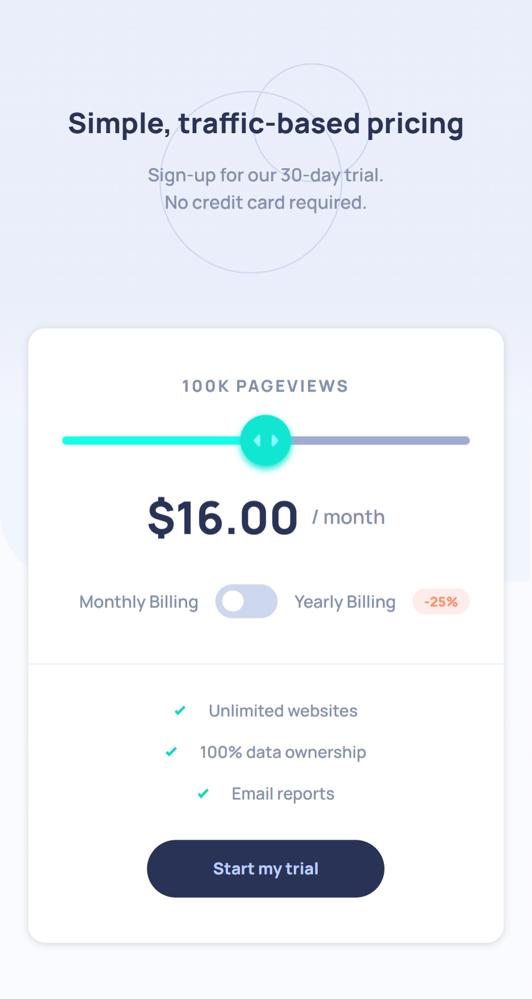
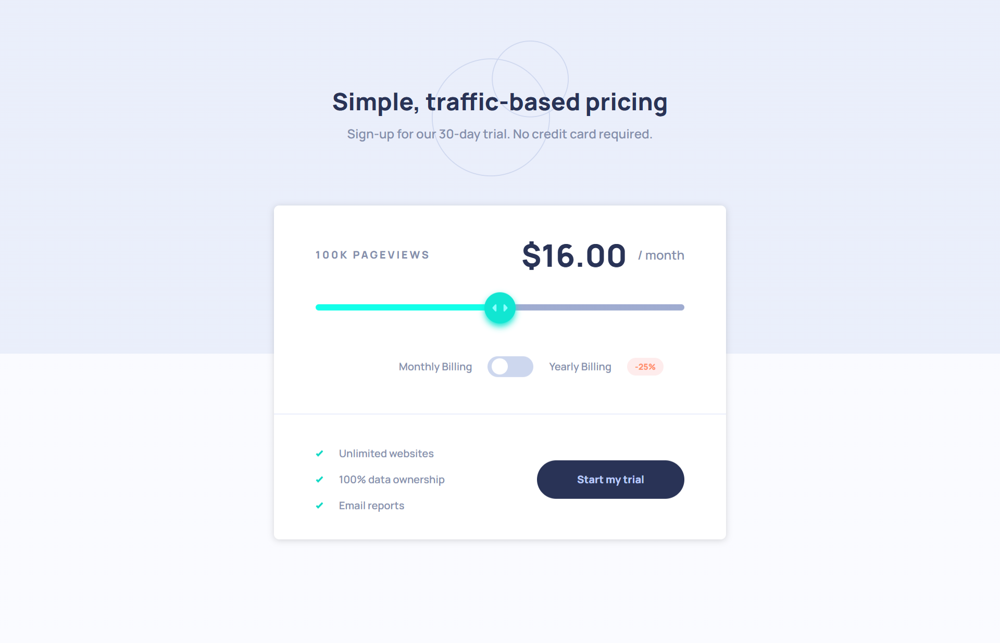

# Frontend Mentor - Interactive pricing component solution

This is a solution to the [Interactive pricing component challenge on Frontend Mentor](https://www.frontendmentor.io/challenges/interactive-pricing-component-t0m8PIyY8). Frontend Mentor challenges help you improve your coding skills by building realistic projects. 

## Table of contents

- [Overview](#overview)
  - [The challenge](#the-challenge)
  - [Screenshot](#screenshot)
  - [Links](#links)
  - [Built with](#built-with)
- [Author](#author)

## Overview

### The challenge

Users should be able to:

- View the optimal layout for the app depending on their device's screen size
- See hover states for all interactive elements on the page
- Use the slider and toggle to see prices for different page view numbers

### Screenshot

### Links

- Solution URL: [https://www.frontendmentor.io/solutions/responsive-pricing-component-with-wcag-a11y-semantic-html-css-and-js-x1X78LuQ11](https://www.frontendmentor.io/solutions/responsive-pricing-component-with-wcag-a11y-semantic-html-css-and-js-x1X78LuQ11)
- Live Site URL: [https://thedmvdevaustin-pricing-component.netlify.app/](https://thedmvdevaustin-pricing-component.netlify.app/)

## My process

### Built with

- Semantic HTML5 markup
- CSS custom properties
- Flexbox
- CSS Grid
- Mobile-first workflow

## Author

- Frontend Mentor - [@thedmvdevaustin](https://www.frontendmentor.io/profile/thedmvdevaustin)
- Twitter - [@thedmvdevaustin](https://www.twitter.com/thedmvdevaustin)
- LinkedIn - [@thedmvdevaustin](https://www.linkedin.com/in/thedmvdevaustin)
