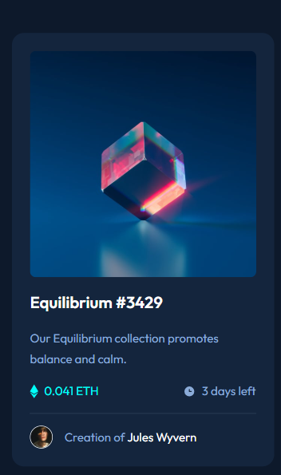
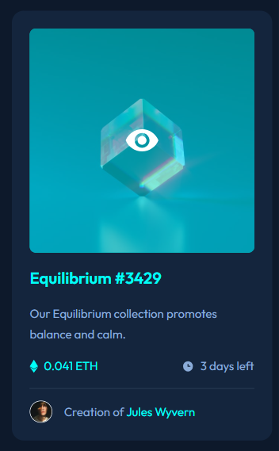
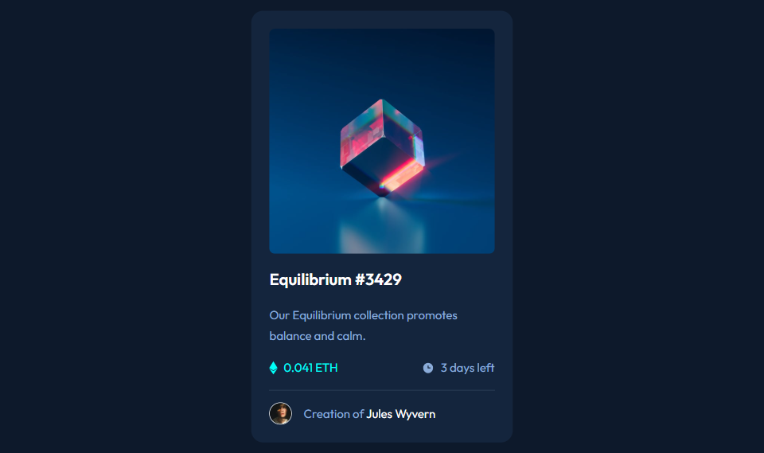
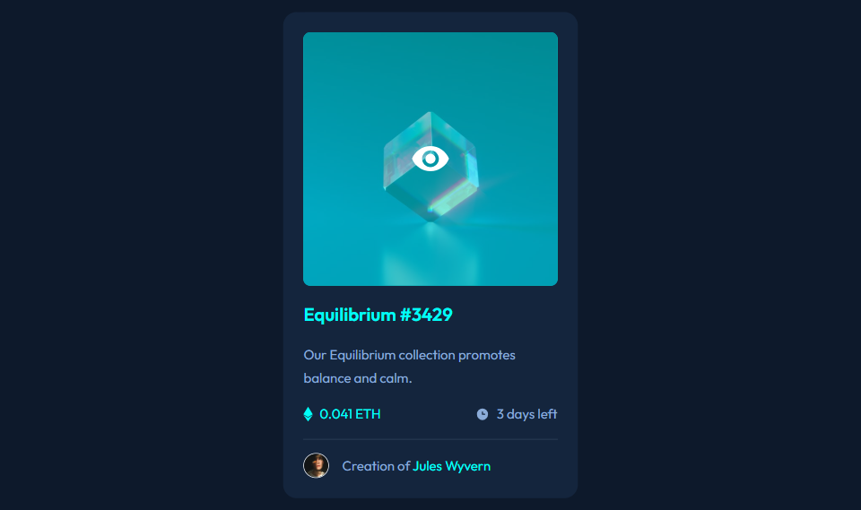

# Frontend Mentor - NFT preview card component solution

This is a solution to the [NFT preview card component challenge on Frontend Mentor](https://www.frontendmentor.io/challenges/nft-preview-card-component-SbdUL_w0U). Frontend Mentor challenges help you improve your coding skills by building realistic projects. 

## Table of contents

- [Overview](#overview)
  - [The challenge](#the-challenge)
  - [Screenshot](#screenshot)
  - [Links](#links)
  - [Built with](#built-with)
- [Author](#author)

## Overview
Responsive nft card component made using semantic HMTL, CSS grid and flexbox
### The challenge

Users should be able to:

- View the optimal layout depending on their device's screen size
- See hover states for interactive elements

### Screenshot

### Links

- Solution URL: [solution url](https://github.com/thedmvdevaustin/frontend-mentor-challenges/tree/main/nftPreviewCardComponent/nft-preview-card-component-main)
- Live Site URL: [live site URL](https://frontend-mentor-challenges-nft-preview-card-component.vercel.app/)

### Built with

- Semantic HTML5 markup
- CSS custom properties
- Flexbox
- CSS Grid
- Mobile-first workflow

## Author

- Frontend Mentor - [@thedmvdevaustin](https://www.frontendmentor.io/profile/yourusername)
- Twitter - [@thedmvdevaustin](https://www.twitter.com/yourusername)
