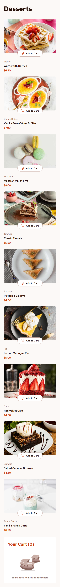
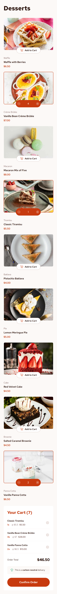
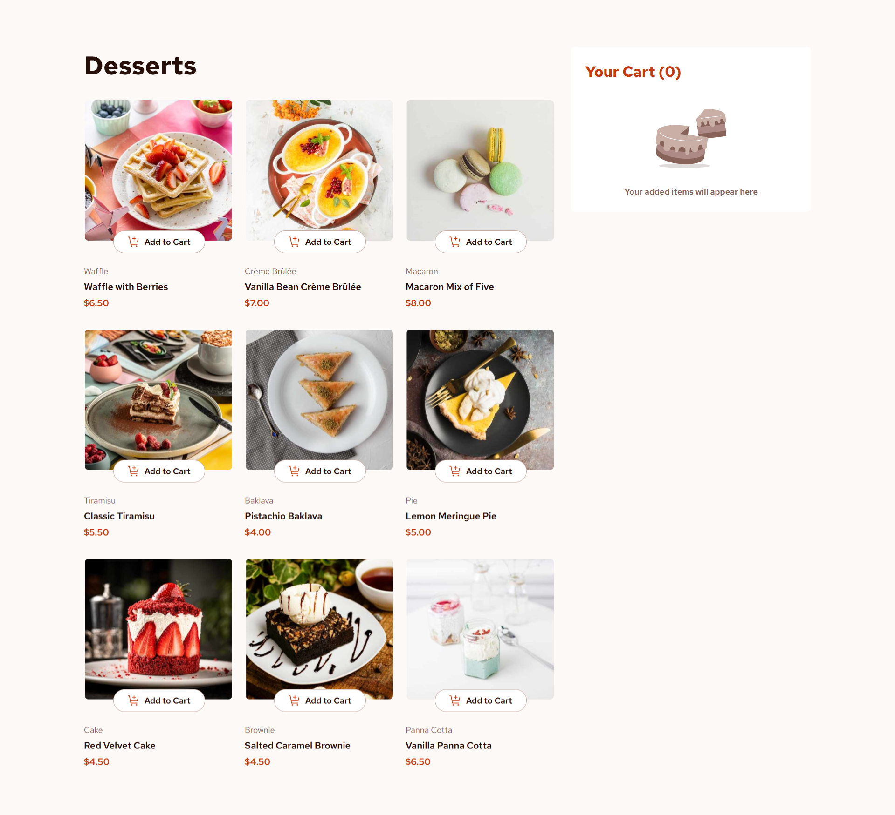
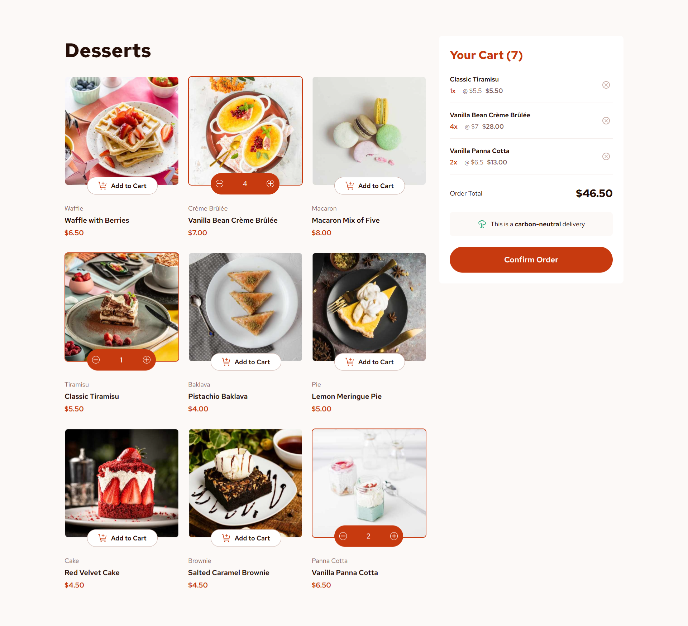
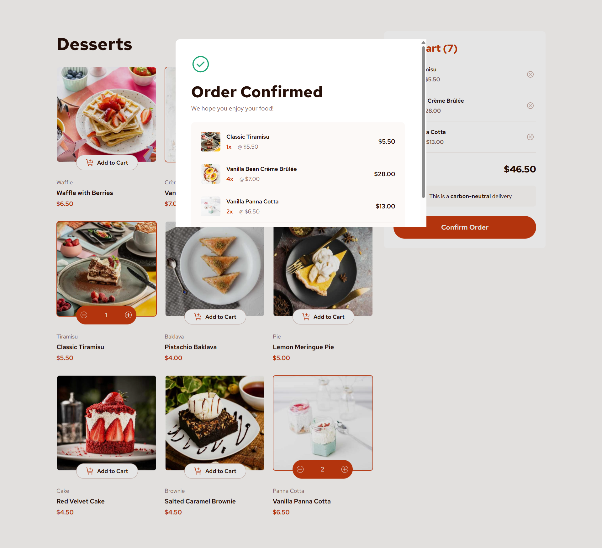

# Frontend Mentor - Product list with cart solution

This is a solution to the [Product list with cart challenge on Frontend Mentor](https://www.frontendmentor.io/challenges/product-list-with-cart-5MmqLVAp_d). Frontend Mentor challenges help you improve your coding skills by building realistic projects. 

## Table of contents

  - [The challenge](#the-challenge)
  - [Screenshot](#screenshot)
  - [Links](#links)
  - [Built with](#built-with)
- [Author](#author)

### The challenge

Users should be able to:

- Add items to the cart and remove them
- Increase/decrease the number of items in the cart
- See an order confirmation modal when they click "Confirm Order"
- Reset their selections when they click "Start New Order"
- View the optimal layout for the interface depending on their device's screen size
- See hover and focus states for all interactive elements on the page

### Screenshot

### Linkshttps://www.frontendmentor.io/solutions/responsive-product-list-semantic-html-wcag-standards-a11y-bem-css-js-5mK0Vd_uKB

- Solution URL: [https://www.frontendmentor.io/solutions/responsive-product-list-semantic-html-wcag-standards-a11y-bem-css-js-5mK0Vd_uKB](https://www.frontendmentor.io/solutions/responsive-product-list-semantic-html-wcag-standards-a11y-bem-css-js-5mK0Vd_uKB)
- Live Site URL: [https://dmvdevaustinproductlistwithcart.netlify.app](https://dmvdevaustinproductlistwithcart.netlify.app)

### Built with

- Semantic HTML5 markup
- CSS custom properties
- Flexbox
- CSS Grid
- Mobile-first workflow

## Author

- Frontend Mentor - [@thedmvdevaustin](https://www.frontendmentor.io/profile/thedmvdevaustin)
- Twitter - [@thedmvdevaustin](https://www.twitter.com/thedmvdevaustin)
- Linkedin - [@thedmvdevaustin](https://www.linkedin.com/in/thedmvdevaustin)